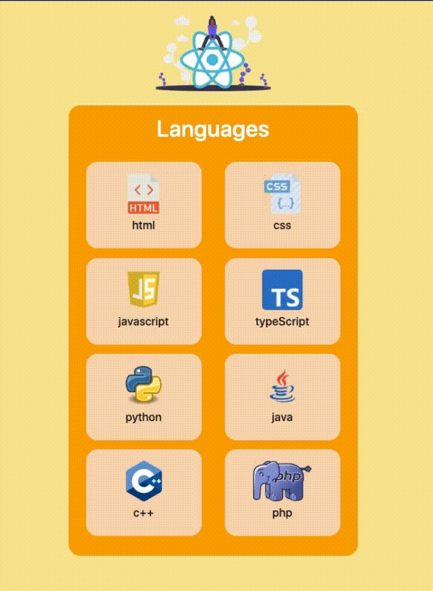

# React Language Card

Create Language Card using React

<hr />

## What I Used

- Bootstrap
- React Bootstrap

### Installation Options

```
$ git clone https://github.com/HilalVildan/Language-Card.git
```

```
$ npm install
```

```
$ npm start
```

### Or

```
$ git clone https://github.com/HilalVildan/Language-Card.git
```

```
$ yarn
```

```
$ yarn start
```

<hr />

### Demo

#### [View Demo](https://languageecard.netlify.app/)

